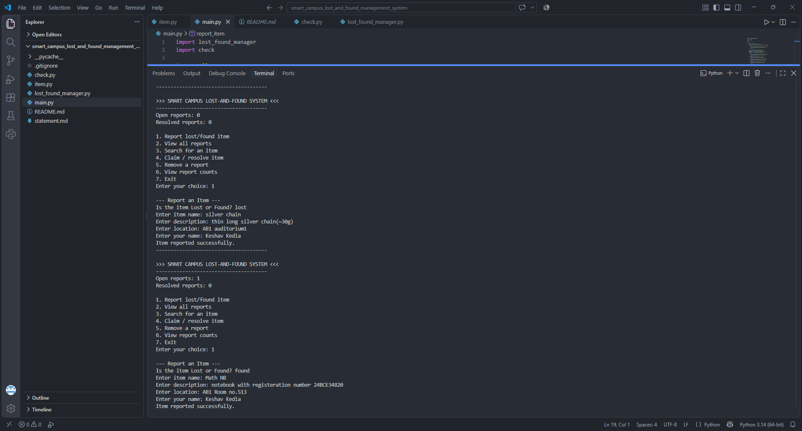
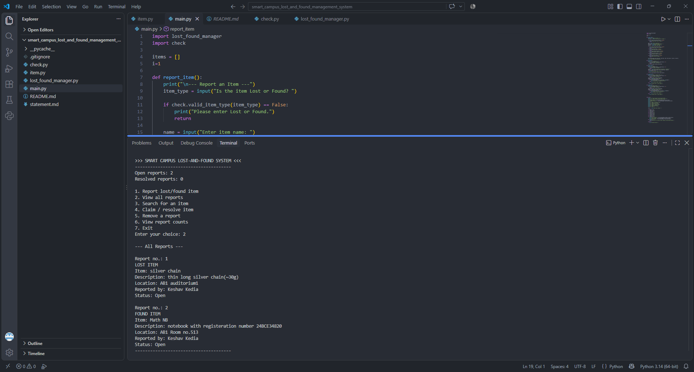
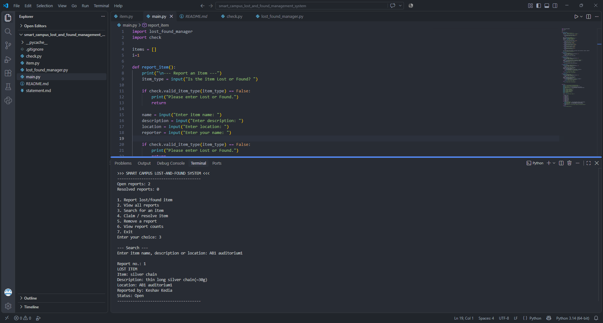
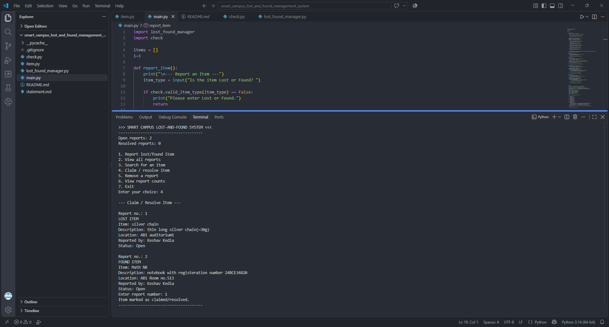
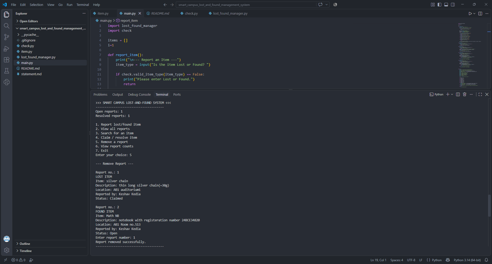
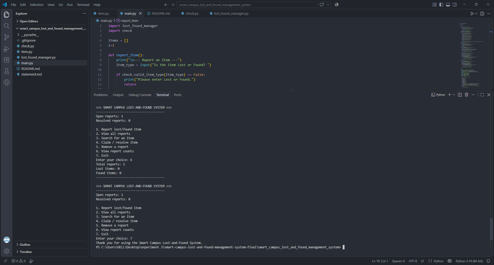

# Smart Campus Lost-and-Found Management System

## Overview
A menu-driven, console-based Python application that helps students and staff report, track and resolve **lost** and **found** items on a campus. Users can file a report, browse all reports, search by keyword, mark an item as claimed/resolved, remove a report, and view live counts. The code is split into small modules (input validation, item model, business logic, and the user interface) so that each part is easy to read, test and extend.

## Features
- **Report an item** as *Lost* or *Found* with name, description, location and reporter name
- **Input validation** for item type (Lost/Found, case-insensitive), empty fields and report numbers
- **View all reports** with a running report number and status (Open / Claimed)
- **Keyword search** across item name, description and location (case-insensitive)
- **Claim / resolve** an item by its report number
- **Remove** a report by its report number
- **Live counters** on the main menu: open and resolved reports
- **Report counts** screen: total, lost and found items
- Friendly error messages instead of crashes for invalid choices or numbers

## Technologies / Tools Used
| Item | Details |
|---|---|
| Language | Python 3 (developed on Python 3.14) |
| Libraries | Standard library only (no external packages) |
| Editor | Visual Studio Code |
| Version control | Git & GitHub |

## Project Structure
```
smart_campus_lost_and_found_management_system/
├── main.py
├── check.py 
├── item.py
├── lost_found_manager.py  
├── README.md
├── statement.md

## Instructions for Testing
The project is tested manually through the console. Run `python main.py` and try the cases below.

| # | Test | Steps | Expected result |
|---|---|---|---|
| 1 | Invalid item type | Option 1, type `water bottle` | "Please enter Lost or Found." and return to menu |
| 2 | Empty fields | Option 1, type `lost`, press Enter for every field | "Item name cannot be empty." and nothing is saved |
| 3 | Report a lost item | Option 1, `lost`, fill all fields | "Item reported successfully." Open reports becomes 1 |
| 4 | Report a found item | Option 1, `found`, fill all fields | Open reports increases by 1 |
| 5 | View reports | Option 2 | All reports listed with numbers and status |
| 6 | Search | Option 3, enter a word from a name/description/location | Only matching reports shown; otherwise "No matching reports found." |
| 7 | Resolve | Option 4, enter a report number | "Item marked as claimed/resolved." Status changes to Claimed |
| 8 | Remove | Option 5, enter a report number | "Report removed successfully." |
| 9 | Invalid report number | Option 4 or 5, enter `abc` | "Please enter a valid number." |
| 10 | Out-of-range number | Option 4 or 5, enter `99` | "Invalid report number." |
| 11 | Empty list | Start the program and choose 2, 3, 4 or 5 | "No reports available." |
| 12 | Counts | Option 6 | Total, lost and found counts shown |
| 13 | Invalid menu choice | Enter `9` | "Invalid choice." |

## Screenshots

**Reporting lost and found items**



**Viewing all reports**



**Searching for an item**



**Claiming / resolving an item**



**Removing a report**



**Report counts and exit**



**Error handling (invalid type and empty fields)**


## Known Limitations
- Data is stored in memory only, so all reports are lost when the program exits.
- There is no user login; anyone using the program can resolve or remove any report.

See `statement.md` for the problem statement and project scope.
